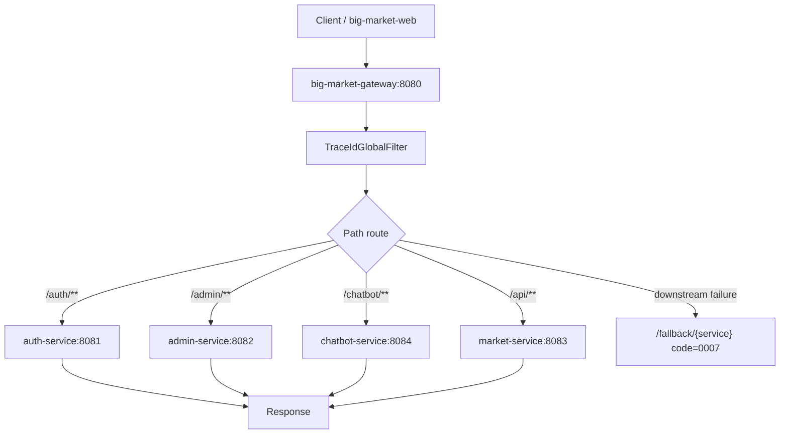
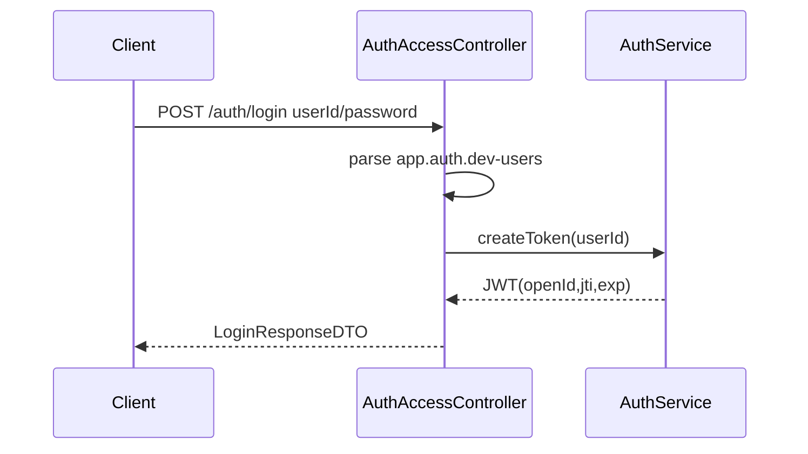
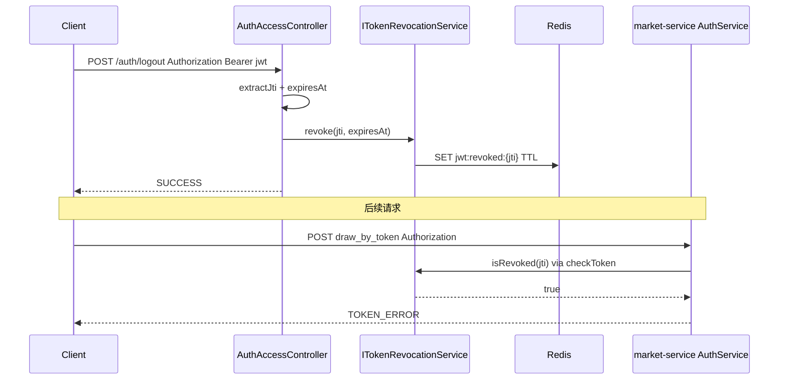
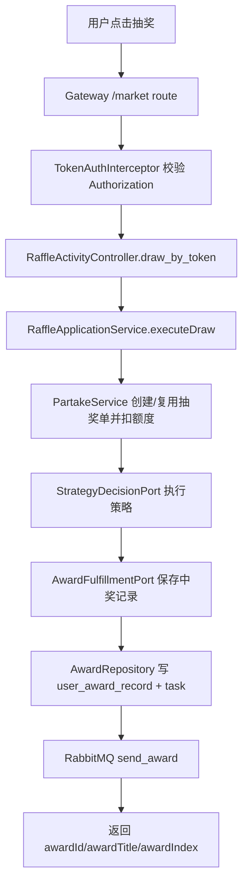
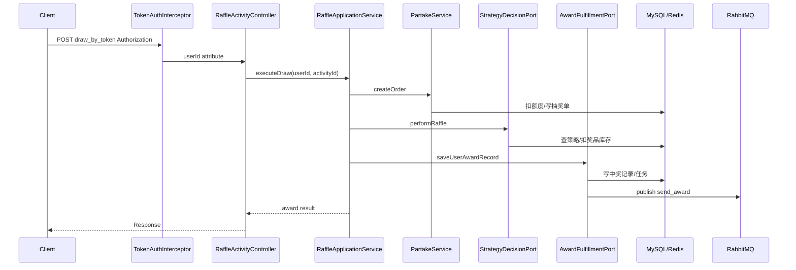
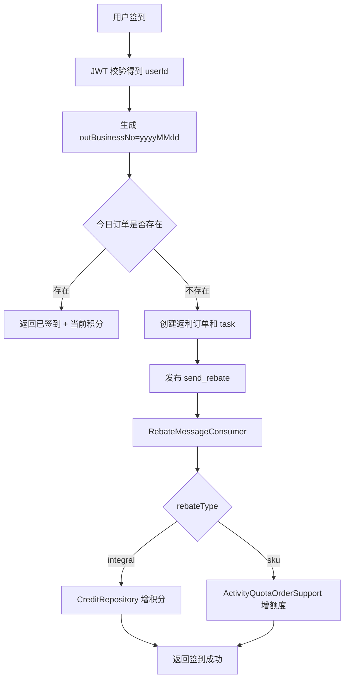
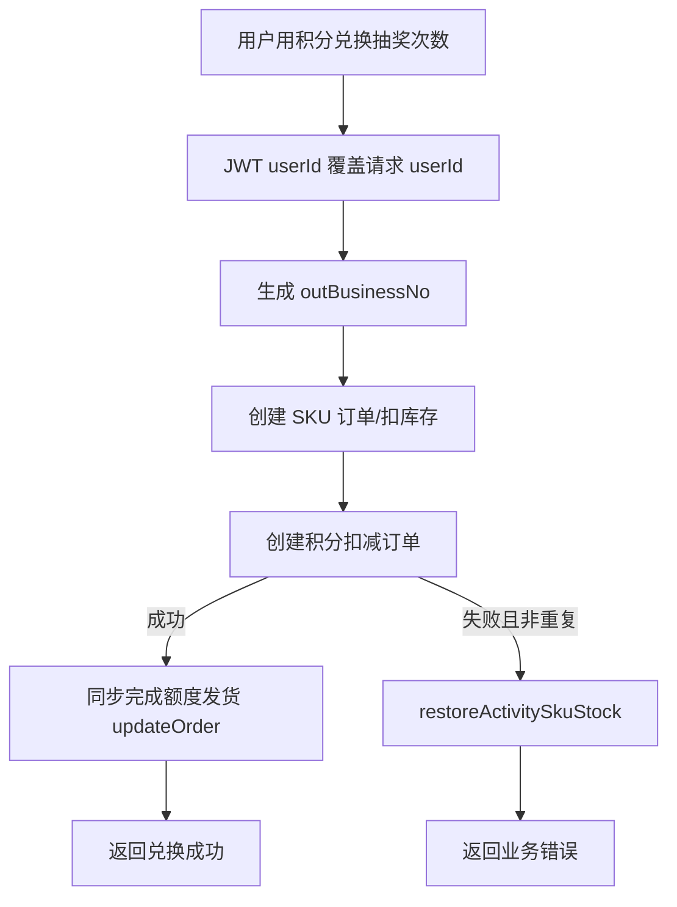
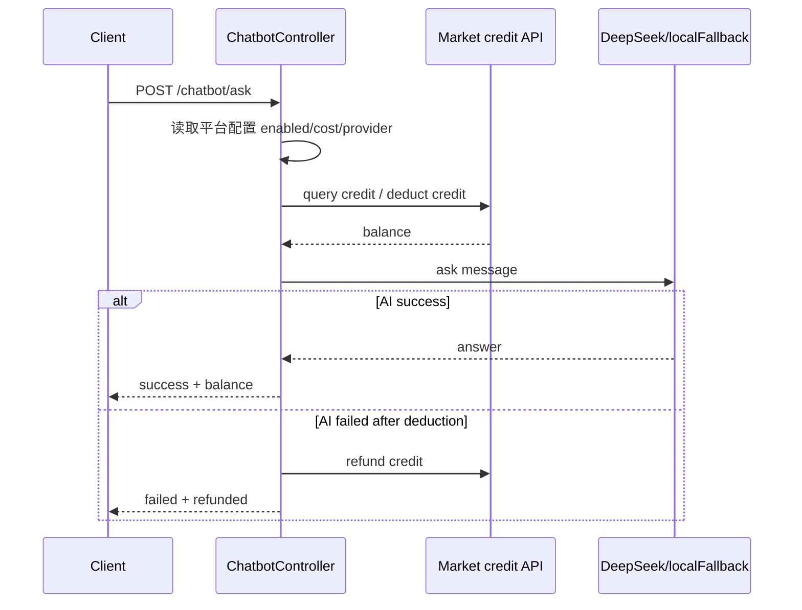
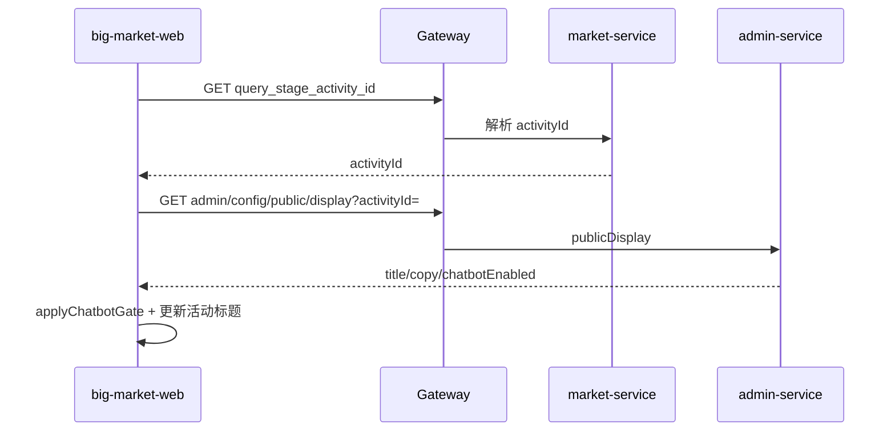
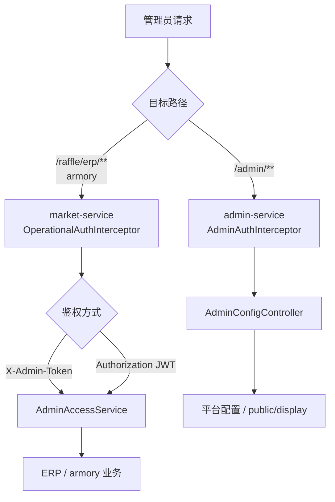

# 01 URL 请求流程

## big-market-web 页面

用户端与管理端为原生 HTML/CSS/JS（非 React），桌面/Web 布局，无独立移动端导航。

| 页面 | 文件 | 说明 |
| --- | --- | --- |
| 用户主应用 | `big-market-web/index.html` + `app.js` | 登录后抽奖、Chatbot、用户中心；活动 ID 由 `query_stage_activity_id` 解析 |
| 登录 | `big-market-web/login.html` + `login.js` + `login-common.js` | 调用 `/api/v1/auth/login` |
| 管理端 | `big-market-web/admin.html` + `admin.js` | 平台配置、活动文案、Chatbot 开关 |
| 管理登录 | `big-market-web/admin-login.html` + `admin-login.js` + `login-common.js` | 管理员入口 |

前端在解析 `activityId` 后调用公开展示配置 API，并根据 `chatbotEnabled` 控制 Chatbot 入口。

## URL 总览

| URL | Method | 入口 | 鉴权 | 主业务 |
| --- | --- | --- | --- | --- |
| `/api/v1/auth/login` | POST | `AuthAccessController.login` | 账号密码 | 生成 JWT |
| `/api/v1/auth/verify` | GET | `AuthAccessController.verify` | Authorization | 校验 JWT |
| `/api/v1/auth/logout` | POST | `AuthAccessController.logout` | Authorization | 撤销 jti |
| `/api/v1/raffle/activity/query_stage_activity_id` | GET | `RaffleActivityController.queryStageActivityId` | 未见拦截 | 渠道/来源查上架活动 |
| `/api/v1/raffle/activity/armory` | GET | `RaffleActivityController.armory` | OperationalAuthInterceptor | 活动和策略预热 |
| `/api/v1/raffle/activity/draw_by_token` | POST | `RaffleActivityController.draw` | TokenAuthInterceptor | 抽奖 |
| `/api/v1/raffle/activity/calendar_sign_rebate_by_token` | POST | `RaffleActivityController.calendarSignRebateByToken` | TokenAuthInterceptor | 签到返利 |
| `/api/v1/raffle/activity/is_calendar_sign_rebate_by_token` | POST | `RaffleActivityController.isCalendarSignRebateByToken` | TokenAuthInterceptor | 查今日是否签到 |
| `/api/v1/raffle/activity/query_user_activity_account_by_token` | POST | `RaffleActivityController.queryUserActivityAccount` | TokenAuthInterceptor | 查抽奖额度 |
| `/api/v1/raffle/activity/query_sku_product_list_by_activity_id` | POST | `RaffleActivityController.querySkuProductListByActivityId` | 未见拦截 | 查可兑换 SKU |
| `/api/v1/raffle/activity/query_user_credit_account_by_token` | POST | `RaffleActivityController.queryUserCreditAccountByToken` | TokenAuthInterceptor | 查积分 |
| `/api/v1/raffle/activity/credit_pay_exchange_sku_by_token` | POST | `RaffleActivityController.creditPayExchangeSku` | TokenAuthInterceptor | 积分兑换抽奖次数 |
| `/api/v1/raffle/activity/chat_credit_deduct_by_token` | POST | `RaffleActivityController.chatCreditDeductByToken` | TokenAuthInterceptor | AI Chat 扣积分 |
| `/api/v1/raffle/activity/chat_credit_refund_by_token` | POST | `RaffleActivityController.chatCreditRefundByToken` | TokenAuthInterceptor | AI Chat 退积分 |
| `/api/v1/raffle/strategy/strategy_armory` | GET | `RaffleStrategyController.strategyArmory` | OperationalAuthInterceptor | 策略装配 |
| `/api/v1/raffle/strategy/query_raffle_award_list_by_token` | POST | `RaffleStrategyController.queryRaffleAwardListByToken` | TokenAuthInterceptor | 查奖品和解锁状态 |
| `/api/v1/raffle/erp/*` | GET/POST | `ErpOperateController` | OperationalAuthInterceptor + Controller 内 `AdminAccessService` | 运营查询/上架 |
| `/api/v1/admin/config/*` | GET/POST | `AdminConfigController` | AdminAuthInterceptor | 平台配置 |
| `/api/v1/admin/config/public/display` | GET | `AdminConfigController.publicDisplay` | 无（`WebMvcConfig` 排除 AdminAuth） | 活动展示配置与 Chatbot 开关（`activityId` 查询参数） |
| `/api/v1/chatbot/ask` | POST | `ChatbotController.ask` | 有扣费时需要 token | AI Chat |

## 网关请求流

## 登录流程

- URL: `/api/v1/auth/login`
- Entry: `AuthAccessController.login`
- Domain: `AuthService.createToken`
- Request: `LoginRequestDTO`
- Response: `LoginResponseDTO`
- 数据写入: Not found in current code. 登录只校验配置中的 `app.auth.dev-users` 并生成 JWT。
- 风险: `dev-users` 是配置式账号源，不是正式用户体系。

## 注销流程

- URL: `/api/v1/auth/logout`
- Entry: `AuthAccessController.logout`
- Domain: `ITokenRevocationService.revoke(jti, expiresAt)`
- Auth header: 支持 `Bearer <jwt>`（`JwtTokenUtils` 统一解析）
- 数据写入: Redis key `jwt:revoked:{jti}`（Docker 栈）或进程内 Map（本地默认）
- 失败行为: Redis 写入失败时 `logout` 返回错误，不返回成功；Redis 模式但无 `RedissonClient` 时服务启动 fail-fast

## 抽奖流程

- URL: `/api/v1/raffle/activity/draw_by_token`
- Entry: `RaffleActivityController.draw(String token, ActivityDrawRequestDTO)`
- Application: `RaffleApplicationService.executeDraw`
- Domain: `IRaffleActivityPartakeService.createOrder`、`IStrategyDecisionPort.performRaffle`、`IAwardFulfillmentPort.saveUserAwardRecord`
- Repository: `ActivityPartakeOrderSupport.saveCreatePartakeOrderAggregate`、`AwardRepository.saveUserAwardRecord`
- Storage/MQ: MySQL、Redis、RabbitMQ `send_award`
- Auth: `TokenAuthInterceptor` 校验 JWT，将 `userId` 放入 request attribute。

## 签到返利流程

- URL: `/api/v1/raffle/activity/calendar_sign_rebate_by_token`
- Entry: `RaffleActivityController.calendarSignRebateByToken`
- Domain: `BehaviorRebateService.createOrder`
- Repository: `BehaviorRebateRepository.saveUserRebateRecord`
- MQ Consumer: `RebateMessageConsumer`
- 幂等: 先查 `rebateReadAdapter.isCalendarSignRebate`，并通过唯一索引冲突返回已签到。

## 积分兑换 SKU 流程

- URL: `/api/v1/raffle/activity/credit_pay_exchange_sku_by_token`
- Entry: `RaffleActivityController.creditPayExchangeSku`
- Domain/Adapter: `IAccountQuotaWriteAdapter.createOrder`、`IAccountCreditWriteAdapter.createOrder`、`IAccountQuotaWriteAdapter.updateOrder`
- Repository: `ActivityQuotaOrderSupport.doSaveCreditPayOrder`、`CreditRepository.saveUserCreditTradeOrder`
- 重要机制: SKU 库存按 `outBusinessNo` 建立预占 ledger，积分明确拒绝时幂等恢复 Redis 与 MySQL/队列；未知结果保留订单等待对账，发货失败由 MQ/XXL 补偿。

## AI Chat 流程

- URL: `/api/v1/chatbot/ask`
- Entry: `ChatbotController.ask`
- External: DeepSeek HTTP API when `provider=deepseek` and apiKey exists；否则本地 fallback。
- Internal HTTP: 调用 market 的 `chat_credit_deduct_by_token` 和 `chat_credit_refund_by_token`。

## 公开展示配置流

- URL: `/api/v1/admin/config/public/display?activityId={id}`
- Entry: `AdminConfigController.publicDisplay`
- 鉴权: 无管理员 token；`WebMvcConfig` 排除 `/api/*/admin/config/public/**`
- 网关: 走现有 `/admin/**` 路由，无需修改 gateway
- 前端: `big-market-web/app.js` 的 `resolveActivityId()` → `loadDisplayConfig()`
- 响应字段: `title`、`copy`、`state`、`chatbotEnabled`

## ERP / Admin 配置流

- ERP/armory：由 **market-service** 的 `OperationalAuthInterceptor` 拦截；支持 `X-Admin-Token` 或 `openId` 在 `app.admin.user-ids` 中的管理员 JWT。Controller 内通过 `AdminAccessService` 复用同一套校验（含 Dubbo 无 HTTP 拦截时的兜底）。运行时开关由 Admin 发布到 Nacos，不经过 Market HTTP。
- Admin Config：`AdminAuthInterceptor` 仅在 **admin-service** 拦截 `/api/*/admin/**`；`AdminConfigController` 读写 `PlatformConfigService`（`public/display` 除外）。

