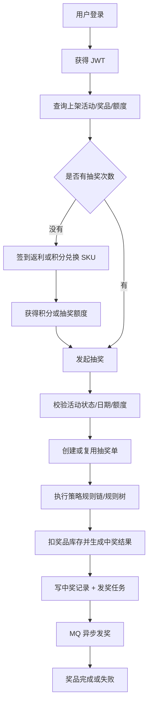
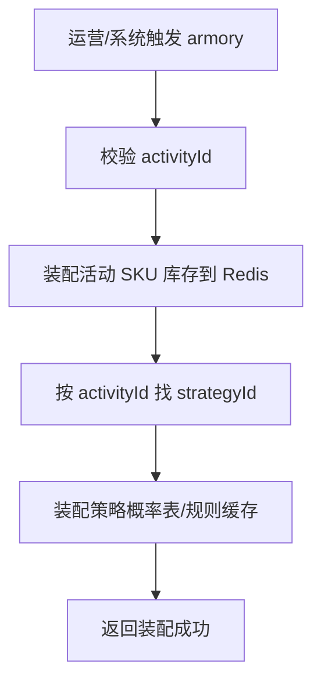
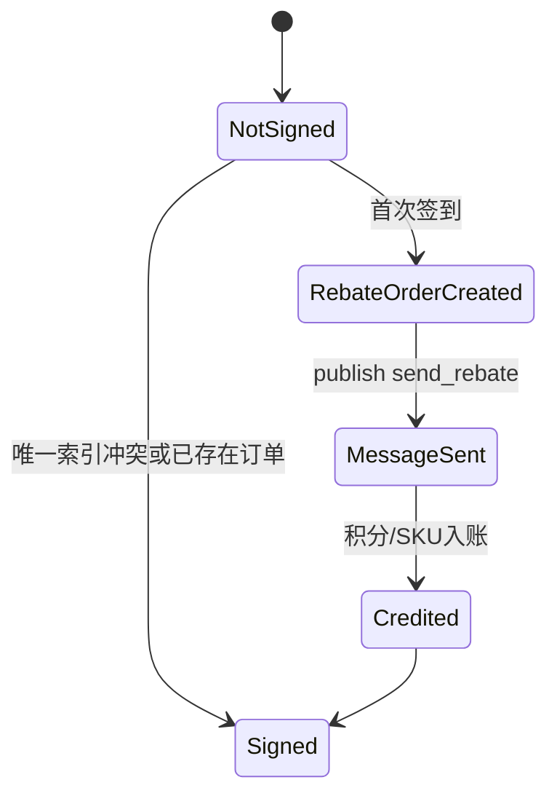
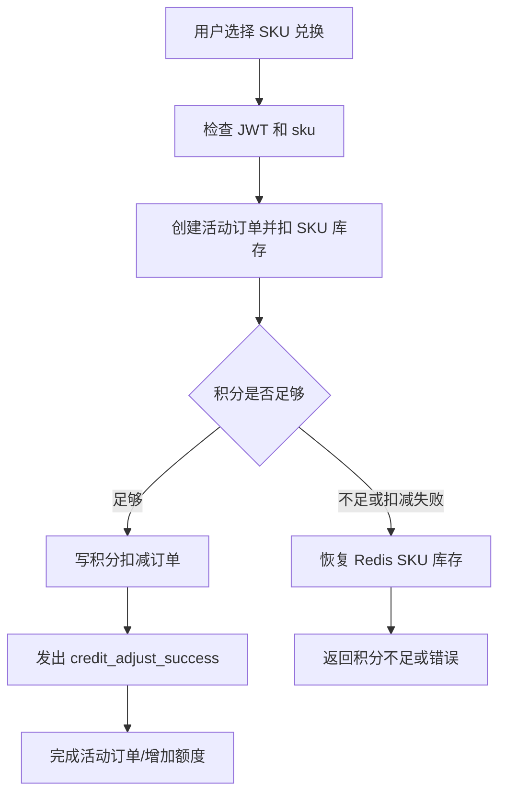
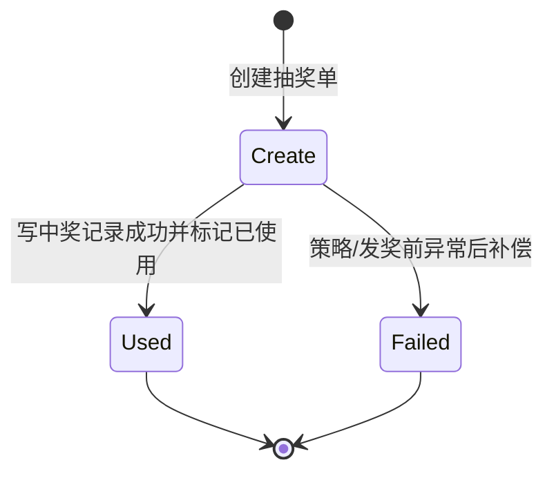
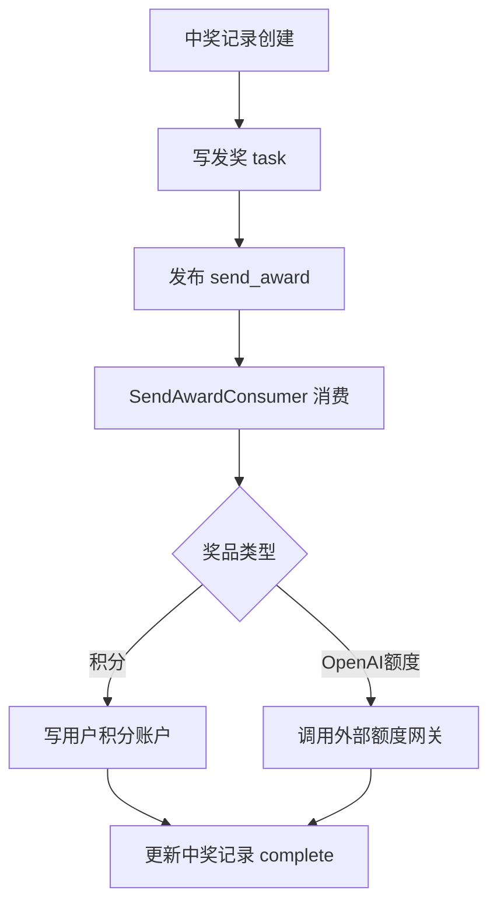
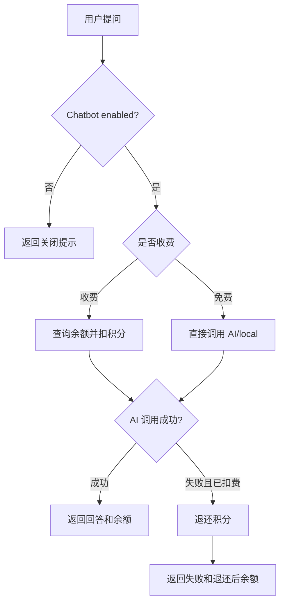

# 02 业务流程与业务机制

## 业务域

当前代码实现营销抽奖平台，包含活动、策略、账户额度、积分、返利、发奖、运营、AI Chat 等业务。

主要角色：

- 普通用户：登录、签到、兑换抽奖次数、抽奖、查询账户/奖品、使用 AI Chat。
- 管理员/运营：查询抽奖订单、上架活动、动态配置、平台配置。
- 系统任务：MQ 消费、XXL-Job 补偿、库存异步落库。

## 业务总流程

## 机制 1：活动装配和策略预热

- Business meaning: 运营把活动/策略配置加载进缓存，减少抽奖时 DB 压力。
- Code location: `RaffleActivityController.armory`、`ActivityArmory`、`StrategyArmoryDispatch`。
- Data read/write: 活动、SKU、策略、奖品、规则表；Redis 缓存。
- Risk: 装配接口未在 controller 层发现用户鉴权；是否允许公开调用取决于网关/部署侧控制。

## 机制 2：签到返利

- Business meaning: 用户每天签到获得积分或 SKU 返利。
- Code location: `RaffleActivityController.calendarSignRebate`、`BehaviorRebateService`、`BehaviorRebateRepository`、`RebateMessageConsumer`。
- Data written: `user_behavior_rebate_order`、task/outbox、`user_credit_account` 或活动额度相关表。
- Idempotency: `outBusinessNo=yyyyMMdd`；重复签到返回已签到。

## 机制 3：积分兑换抽奖次数

- Business meaning: 用户用积分购买活动 SKU，得到额外抽奖额度。
- Code location: `RaffleActivityController.creditPayExchangeSku`、`ActivityRepository.doSaveCreditPayOrder`、`CreditRepository.saveUserCreditTradeOrder`、`CreditAdjustSuccessConsumer`。
- Data written: 活动订单、积分订单、账户额度。
- Failure branch: 积分扣减失败会调用 `restoreActivitySkuStock`；发货失败记录日志并依赖 MQ 消费补偿。

## 机制 4：抽奖

- Business meaning: 用户消耗一次活动额度，按策略和规则抽出奖品。
- Code location: `RaffleApplicationService.executeDraw`、`AbstractRaffleActivityPartake`、`DefaultRaffleStrategy`、`AwardRepository.saveUserAwardRecord`。
- Business validations: 活动状态 open、活动日期、额度足够、抽奖单未使用。
- State transition: `user_raffle_order` 从 create 到 used；失败时补偿为 failed 或回滚额度。

## 机制 5：发奖

- Business meaning: 抽中奖品后异步完成奖品发放。
- Code location: `AwardRepository.saveUserAwardRecord`、`SendAwardConsumer`、`AwardService.distributeAward`、`AwardRepository.saveGiveOutPrizesAggregate`。
- Data written: `user_award_record`、task/outbox、积分账户或外部 OpenAI 额度。
- Async: `send_award` MQ。
- Risk: 外部 OpenAI 额度网关失败依赖异常和任务补偿，未发现独立熔断实现。

## 机制 6：运营上架和查询

- Business meaning: 管理员查询 ES 中的抽奖订单、查询上架列表、把 staged 活动改为 active 并装配。
- Code location: `ErpOperateController`、`RaffleActivityStageService`、`ESUserRaffleOrderRepository`。
- Auth: `X-Admin-Token` 或管理员 JWT。
- Data read/write: ES 查询、`raffle_activity_stage` 更新。

## 机制 7：AI Chat 积分消费

- Business meaning: 用户使用 AI Chat 前扣积分，AI 调用失败退还积分。
- Code location: `ChatbotController.ask`、`RaffleActivityController.chatCreditDeductByToken`、`chatCreditRefundByToken`。
- Data written: user credit order/account。
- Idempotency: requestId 映射为 `chat_{requestId}` 和 `chat_refund_{requestId}`。

