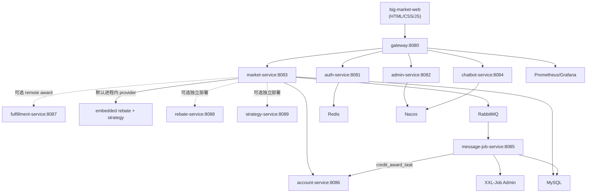

# 03 架构总览

> 服务端口、职责与核心流程的权威表见 [`../MICROSERVICES.md`](../MICROSERVICES.md)。就绪边界见 [`../LEARNING-FREEZE.md`](../LEARNING-FREEZE.md)。本文保留总览图与前端要点，避免与 MICROSERVICES 重复维护服务清单。

## 架构图

> **说明：** 默认 compose 仅启 8080-8086；8087/8088/8089 为可选独立 provider。rebate/strategy 由 market **embedded** provider 托管。默认积分奖不走 remote fulfillment：`SendAwardConsumer`（message-job）写 `credit_award_task`，`DispatchCreditAwardTaskJob` 再调 account。独立 provider / remote award / fresh / secure 未纳入冻结审计动态验收。

## 主要职责（摘要）

| 组件 | 要点 |
| --- | --- |
| Gateway | 路由、trace、Resilience4j fallback |
| Auth | JWT 签发 / 校验 / 吊销 |
| Market | raffle / activity / strategy / ERP / DCC HTTP；不扫 `trigger.job`/`listener` |
| Message-job | RabbitMQ 消费者 + XXL-Job（含积分 outbox 派发） |
| Account | 积分 / 配额 Dubbo |
| Admin | 平台配置；`GET .../public/display` 公开只读 |
| Web | 原生 HTML/CSS/JS，API 统一经 `8080` |

共享库：`domain` / `infrastructure` / `api` / `types` / starters。模块边界见 [04-module-or-service-boundaries.md](04-module-or-service-boundaries.md)。

## 前端与公开配置

`big-market-web` 启动流程要点：

1. `query_stage_activity_id` 按渠道/来源解析 `activityId`。
2. `GET /api/v1/admin/config/public/display?activityId=` 取标题、文案、`chatbotEnabled`。
3. 按 `chatbotEnabled` 控制 Chatbot；消息渲染用 DOMPurify。
4. 抽奖记录与积分流水在 `localStorage`；侧栏抽屉互斥。
5. 未登录落地页可整页滚动；主应用聊天区居中。

## 基础设施

本地中间件：`docs/dev-ops/docker-compose-environment.yml`。应用容器：`docker-compose.yml`。启动步骤：[16-local-setup.md](16-local-setup.md)。
