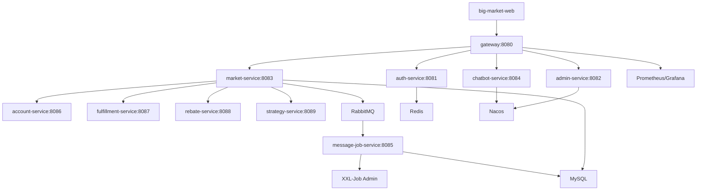

# 03 Architecture Overview

## Runtime Shape

The repository is organized as independently deployable service launchers plus
shared library modules. The service launchers are:

- `big-market-gateway`
- `big-market-auth-service`
- `big-market-admin-service`
- `big-market-market-service`
- `big-market-chatbot-service`
- `big-market-message-job-service`
- `big-market-account-service`
- `big-market-fulfillment-service`
- `big-market-rebate-service`
- `big-market-strategy-service`

Shared libraries include `big-market-domain`, `big-market-infrastructure`,
`big-market-api`, `big-market-types`, `big-market-starter-db-router`,
`big-market-starter-dcc`, and `big-market-starter-ratelimiter`.

## Architecture Diagram

## Main Responsibilities

- Gateway: `big-market-gateway/src/main/resources/application.yml` defines path
  routing and circuit-breaker fallback.
- Auth: `big-market-auth-service/src/main/java/com/dyx/market/auth/AuthAccessController.java`
  issues and verifies JWTs.
- Market: `big-market-trigger/src/main/java/com/dyx/market/trigger/http`
  exposes the raffle, activity, strategy, ERP, and DCC APIs.
- Message jobs: `big-market-message-job-service/src/main/java/com/dyx/market/message/job`
  runs outbox dispatch and RabbitMQ/XXL-Job infrastructure.
- Account/Fulfillment/Rebate/Strategy: provider modules expose Dubbo service
  contracts defined in `big-market-api/src/main/java/com/dyx/market/trigger/api`.

## Infrastructure

Local infrastructure is defined in
`docs/dev-ops/docker-compose-environment.yml`: MySQL, Redis, RabbitMQ, Nacos,
Elasticsearch, XXL-Job Admin, Prometheus, Grafana, and support UIs. Application
containers are defined in `docker-compose.yml`.
