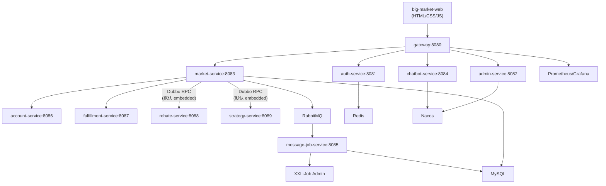

# 03 架构总览

## 运行时形态

仓库由可独立部署的服务启动器与共享库模块组成。服务启动器包括：

- `big-market-gateway`
- `big-market-auth-service`
- `big-market-admin-service`
- `big-market-market-service`
- `big-market-chatbot-service`
- `big-market-message-job-service`
- `big-market-account-service`
- `big-market-fulfillment-service`
- `big-market-rebate-service`
- `big-market-strategy-service`

共享库包括 `big-market-domain`、`big-market-infrastructure`、`big-market-api`、`big-market-types`、`big-market-starter-db-router`、`big-market-starter-dcc` 和 `big-market-starter-ratelimiter`。

用户端 `big-market-web` 为原生 HTML/CSS/JS 静态前端（非 React），经 Nginx 或 `server.py` 提供页面，API 统一走网关 `8080`。面向桌面/Web 布局，无独立移动端导航。

## 架构图

> **说明：** `rebate-service` 和 `strategy-service` 在默认配置下以 **embedded provider** 模式运行于 `market-service` 进程内（`rebate.embedded-rpc-provider.enabled=true`），docker-compose 默认栈不需要单独启动这两个容器。将 `embedded-rpc-provider.enabled` 改为 `false` 并启动对应服务容器，即可切换为独立进程 Dubbo RPC 模式。

## 主要职责

- **Gateway**：`big-market-gateway/src/main/resources/application.yml` 定义路径路由与熔断降级 fallback。
- **Auth**：`big-market-auth-service/src/main/java/com/dyx/market/auth/AuthAccessController.java` 签发与校验 JWT。
- **Market**：`big-market-trigger/src/main/java/com/dyx/market/trigger/http` 暴露 raffle、activity、strategy、ERP、DCC 等 API。
- **Admin**：`big-market-admin-service/src/main/java/com/dyx/market/admin/AdminConfigController.java` 管理平台配置；`GET /api/v1/admin/config/public/display?activityId=` 为公开只读接口（无需管理员鉴权，走现有 `/admin/**` 网关路由，无需改 gateway 配置）。
- **Message jobs**：`big-market-message-job-service/src/main/java/com/dyx/market/message/job` 运行 outbox 派发与 RabbitMQ/XXL-Job 基础设施。
- **Account/Fulfillment/Rebate/Strategy**：provider 模块暴露 `big-market-api/src/main/java/com/dyx/market/trigger/api` 中定义的 Dubbo 服务契约。
- **big-market-web**：`index.html` / `login.html` / `admin.html` 等页面；`app.js` 编排活动 ID 解析、展示配置、抽奖、Chatbot、本地历史记录等。

## 前端与公开配置

`big-market-web` 启动流程要点：

1. 调用 `query_stage_activity_id` 按渠道/来源解析 `activityId`。
2. 调用 `GET /api/v1/admin/config/public/display?activityId=` 获取活动标题、文案、`chatbotEnabled` 等展示配置。
3. 根据 `chatbotEnabled` 控制 Chatbot 入口；消息渲染使用 DOMPurify 防 XSS。
4. 抽奖记录与积分流水保存在浏览器 `localStorage`；抽奖/用户中心侧栏抽屉互斥打开。
5. 未登录落地页支持整页滚动；主应用聊天区消息居中布局。

## 基础设施

本地基础设施定义在 `docs/dev-ops/docker-compose-environment.yml`：MySQL、Redis、RabbitMQ、Nacos、Elasticsearch、XXL-Job Admin、Prometheus、Grafana 及配套 UI。应用容器定义在 `docker-compose.yml`。
