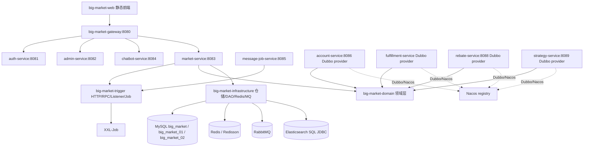

# 03 架构总览

## 实际架构风格

当前仓库是“共享领域/基础设施 jar + 多 Spring Boot 启动器”的混合架构。它不是纯单体，也不是已经彻底拆分完成的微服务系统。

证据：

- 父 `pom.xml` 同时包含 `big-market-app`、`big-market-domain`、`big-market-trigger`、`big-market-infrastructure`、`big-market-api`、`big-market-gateway` 和多个 `*-service` 模块。
- `big-market-app/src/main/java/com/dyx/market/Application.java` 是传统一体化启动器。
- `big-market-market-service` 依赖 `big-market-trigger`、`big-market-infrastructure`，承接主 HTTP 业务。
- `big-market-account-service`、`big-market-rebate-service`、`big-market-strategy-service`、`big-market-fulfillment-service` 暴露 Dubbo provider。
- `application.yml` 中大量远程开关默认 false，例如 `ACCOUNT_SERVICE_REMOTE_READ_ENABLED:false`、`REBATE_SERVICE_REMOTE_CREATE_ORDER_ENABLED:false`、`STRATEGY_SERVICE_REMOTE_READ_ENABLED:false`。

## 总体架构图

## 分层结构

- 接入层：`big-market-trigger/src/main/java/com/dyx/market/trigger/http`，以及 `auth-service`、`admin-service`、`chatbot-service` 自己的 controller。
- 应用服务层：`RaffleApplicationService` 负责抽奖主流程编排。
- 领域层：activity、strategy、award、credit、rebate、auth、task。
- 端口/适配器：domain 下定义 port/repository 接口，infrastructure 和 trigger/config 下提供本地/远程适配器。
- 基础设施层：MyBatis DAO、Redis、MQ、ES、DB Router、EventPublisher。

## 运行入口

- `big-market-app`: `com.dyx.market.Application`
- `big-market-gateway`: `GatewayApplication`
- `big-market-auth-service`: `AuthServiceApplication`
- `big-market-admin-service`: `AdminServiceApplication`
- `big-market-chatbot-service`: `ChatbotServiceApplication`
- `big-market-market-service`: `MarketServiceApplication`
- `big-market-message-job-service`: `MessageJobServiceApplication`
- `big-market-account-service`: `AccountServiceApplication`
- `big-market-rebate-service`: `RebateServiceApplication`
- `big-market-strategy-service`: `StrategyServiceApplication`
- `big-market-fulfillment-service`: `FulfillmentServiceApplication`

## 配置结构

- 网关路由和熔断：`big-market-gateway/src/main/resources/application.yml`
- 主业务服务：`big-market-market-service/src/main/resources/application.yml`
- 一体化应用：`big-market-app/src/main/resources/application-dev.yml`、`application-prod.yml`
- 各拆分服务：对应模块 `src/main/resources/application.yml`
- 容器编排：`docker-compose.yml` 和 `docs/dev-ops/docker-compose-environment*.yml`

## 架构问题

- 服务化处于过渡态，主链路仍大量依赖共享 domain/infrastructure jar，边界不是完全隔离。
- 部分 proposed SQL 和 feature flag 说明显示未来计划存在，但默认未启用，不能当成当前已承接流量。
- 多服务共享同一 infrastructure DAO 包，数据所有权边界仍偏模糊。

## 改进建议

No real implementation found. This is only a future improvement recommendation.

- 为每个服务建立更清晰的数据所有权文档和强制依赖规则。
- 将远程适配器 feature flag 的启用条件做成可执行验收脚本。
- 为 Dubbo provider 重复注册风险增加启动期检测或部署校验。

