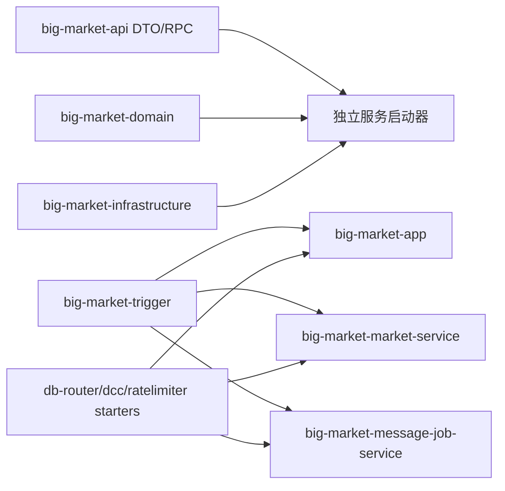

# 04 模块与服务边界

## 边界总表

| 名称 | 类型 | 责任 | 是否独立部署 | 主要依赖 | 边界质量 |
| --- | --- | --- | --- | --- | --- |
| `big-market-app` | Spring Boot 应用 | 传统一体化启动 | 是 | trigger、infrastructure、starter | 旧入口，仍可学习全量链路 |
| `big-market-gateway` | Spring Cloud Gateway | 路由、trace、熔断、限流配置 | 是 | Gateway/Resilience4j | 清晰 |
| `big-market-auth-service` | Spring Boot 服务 | 登录、校验、注销 | 是 | domain auth、api | 较清晰 |
| `big-market-admin-service` | Spring Boot 服务 | 平台配置管理 | 是 | management、domain auth | 较清晰 |
| `big-market-chatbot-service` | Spring Boot 服务 | AI Chat，调用积分扣减/退还 | 是 | management、RestTemplate | 边界清晰，依赖 market HTTP |
| `big-market-market-service` | Spring Boot 服务 | 主业务 HTTP：抽奖、签到、积分兑换、ERP、DCC | 是 | trigger、domain、infrastructure | 当前主业务聚合服务 |
| `big-market-message-job-service` | Spring Boot 服务 | MQ 消费、DLQ、XXL 补偿任务 | 是 | trigger、infrastructure | 清晰但仍共享仓储 |
| `big-market-account-service` | Dubbo provider | 积分账户/活动账户 RPC | 是 | domain、infrastructure | 暗启动/部分实现 |
| `big-market-fulfillment-service` | Dubbo provider | 发奖 RPC | 是 | domain、infrastructure | 暗启动 |
| `big-market-rebate-service` | Dubbo provider | 返利 RPC | 是 | domain、infrastructure | 暗启动 |
| `big-market-strategy-service` | Dubbo provider | 策略读 RPC | 是 | domain、infrastructure | 读服务边界较窄 |
| `big-market-api` | 共享 API jar | DTO、Response、Dubbo 接口 | 否 | lombok、validation | 清晰 |
| `big-market-domain` | 共享领域 jar | 领域模型、服务、端口接口 | 否 | types | 清晰但被多服务共享 |
| `big-market-infrastructure` | 共享基础设施 jar | DAO、仓储、Redis、EventPublisher、端口实现 | 否 | MyBatis、Redis、DB Router | 边界偏宽 |
| `big-market-trigger` | 共享接入 jar | HTTP Controller、MQ listener、XXL job、本地适配器 | 否 | domain、api | 在 market/message-job/app 中复用 |
| `big-market-management` | 共享管理 jar | 平台配置、Nacos 同步 | 否 | Nacos | 清晰 |
| `big-market-starter-db-router` | starter | 分库分表数据源路由 | 否 | JDBC/MyBatis/Hikari | 清晰 |
| `big-market-starter-dcc` | starter | `@DCCValue` 动态配置 | 否 | Spring AOP/Zookeeper | 清晰 |
| `big-market-starter-ratelimiter` | starter | 注解式 Guava RateLimiter | 否 | AOP/Guava | 实现存在，使用点较少 |
| `big-market-types` | 共享 types jar | 常量、枚举、异常、注解、事件 | 否 | Spring web、Hystrix dependency | 清晰 |

## 服务边界图

## 当前边界质量判断

- HTTP 用户流量主要由 gateway 转到 auth/admin/chatbot/market。
- `market-service` 是真实主业务聚合点，不只是“市场服务”窄边界。
- account/rebate/strategy/fulfillment 的 provider 存在，但远程调用默认多为 false，属于渐进拆分。
- `big-market-infrastructure` 被多个服务共享，所以数据访问边界还没有按服务完全拆开。

## Fix now or later

- 本次安全整改：更新学习文档，避免把暗启动能力误写成已完全上线。
- 高风险整改：真正拆分数据所有权、删除共享仓储依赖、启用远程写链路，需要完整环境和回滚方案；本次不直接启用。

