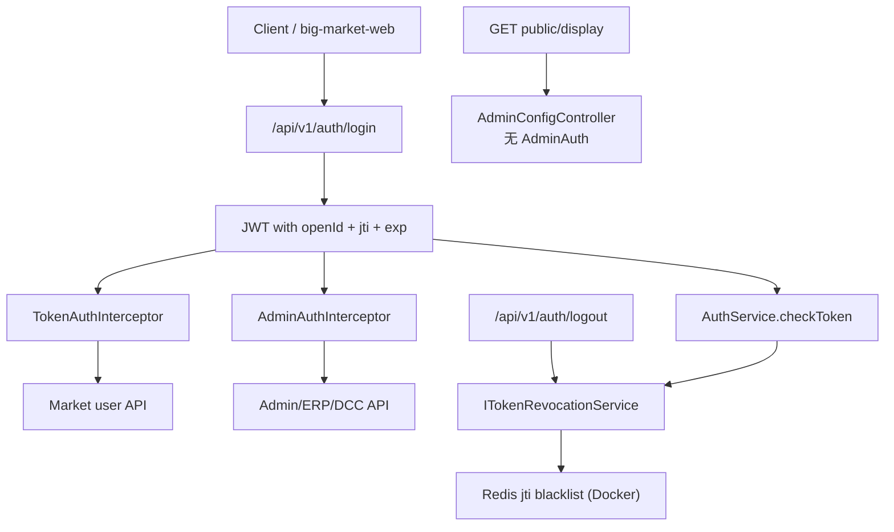

# 05 鉴权与授权

## 用户鉴权

JWT 鉴权在 auth 服务实现。

代码路径：

- `big-market-auth-service/src/main/java/com/dyx/market/auth/AuthAccessController.java`
- `big-market-domain/src/main/java/com/dyx/market/domain/auth/service/AuthService.java`
- `big-market-domain/src/main/java/com/dyx/market/domain/auth/service/ITokenRevocationService.java`
- `big-market-domain/src/main/java/com/dyx/market/domain/auth/config/TokenRevocationConfig.java`
- `big-market-domain/src/main/java/com/dyx/market/domain/auth/util/JwtTokenUtils.java`
- `big-market-domain/src/main/java/com/dyx/market/domain/auth/service/DefaultCredentialGuard.java`

`AuthAccessController.login` 校验 `app.auth.dev-users` 中的学习账号，调用 `AuthService.createToken`，返回含 `openId`、`jti`、`iat`、`exp`、`subject` 的 JWT。`verify` 校验 token 有效性。`logout` 提取 `jti` 并写入共享 `ITokenRevocationService`：

| 模式 | 场景 | 行为 |
| --- | --- | --- |
| 内存 | `token-revocation.redis.enabled=false`（本地默认 `mvn spring-boot:run`） | 进程内黑名单；注销**不会**跨服务同步 |
| Redis | `TOKEN_REVOCATION_REDIS_ENABLED=true`（Docker 栈 auth/admin/market） | 通过 `RedisTokenRevocationService` 共享 Redis 黑名单 |

Redis 模式安全规则：

- **启动 fail-fast**：Redis 模式开启但缺少 `RedissonClient` 时，`TokenRevocationConfig` 抛出 `IllegalStateException`——**不会**静默回退内存模式（否则跨服务注销失效）。
- **注销失败可见**：`RedisTokenRevocationService.revoke()` 在 Redis 写入失败时抛错；`AuthAccessController.logout` 返回错误而非假成功。
- **校验 fail-closed**：`RedisTokenRevocationService.isRevoked()` 在 Redis 读取失败时返回 `true`，故障期间 token 无法绕过黑名单。

`JwtTokenUtils` 规范化 `Authorization` 头，接受裸 JWT 或 `Bearer <jwt>`。

## 用户授权

用户 API 由 `TokenAuthInterceptor` 保护：

- `big-market-market-service/src/main/java/com/dyx/market/market/config/TokenAuthInterceptor.java`

历史单体副本已移除。拦截器校验 `Authorization`，将 `userId` 写入 request；带 token 的控制器方法使用该值，不信任请求体中的 userId。

典型受保护 API：

- `/api/v1/raffle/activity/draw_by_token`
- `/api/v1/raffle/activity/calendar_sign_rebate_by_token`
- `/api/v1/raffle/activity/query_user_activity_account_by_token`
- `/api/v1/raffle/activity/query_user_credit_account_by_token`
- `/api/v1/raffle/activity/credit_pay_exchange_sku_by_token`
- `/api/v1/raffle/strategy/query_raffle_award_list_by_token`

## 管理员授权

管理员 API 由 JWT 管理员白名单或配置的 admin token 保护。

代码路径：

- `big-market-admin-service/src/main/java/com/dyx/market/admin/service/config/AdminAuthInterceptor.java`
- `big-market-admin-service/src/main/java/com/dyx/market/admin/service/config/WebMvcConfig.java`
- `big-market-trigger/src/main/java/com/dyx/market/trigger/http/ErpOperateController.java`
- `big-market-trigger/src/main/java/com/dyx/market/trigger/http/DCCController.java`

Admin 配置 API 使用 `AdminAuthInterceptor`。ERP 与 DCC 端点接受 `X-Admin-Token` 或 `openId` 在 `app.admin.user-ids` 中的管理员 JWT。

## 公开只读接口（无管理员鉴权）

`GET /api/v1/admin/config/public/display?activityId=` 供用户端拉取活动展示配置与 Chatbot 开关，**不需要**管理员 token。

- 入口：`AdminConfigController.publicDisplay`
- 排除规则：`WebMvcConfig` 中 `.excludePathPatterns("/api/*/admin/config/public/**")`
- 网关：走现有 `/admin/**` 路由至 `admin-service`，**无需**修改 gateway 配置
- 前端：`big-market-web/app.js` 的 `loadDisplayConfig()` 在解析 `activityId` 后调用

## 学习说明

`app.auth.dev-users` 是本地学习用凭证源。`DefaultCredentialGuard` 在非开发 profile 下阻止不安全默认凭证。真实生产身份体系超出本作品集范围。
