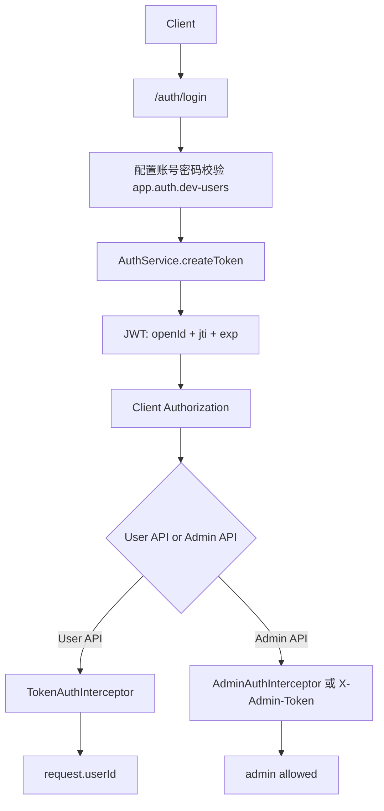

# 05 认证与授权

## Authentication mechanism found

当前代码存在 JWT 认证。

- 生成位置：`AuthAccessController.login` 调用 `AuthService.createToken`
- 校验位置：`AuthService.checkToken`、`TokenAuthInterceptor`、`AdminAuthInterceptor`
- Token 字段：`openId` claim、`jti`、`iat`、`exp`、`subject`
- TTL：`AuthService` 中 24 小时
- Secret：`app.jwt.secret`
- 注销：`AuthAccessController.logout` 提取 jti，调用可选 `ITokenRevocationService`

## Credential source

当前登录账号来自配置：

- `AuthAccessController` 的 `app.auth.dev-users`
- 默认值：`xiaofuge:demo,admin:admin`

这不是完整用户中心。No real implementation found. This is only a future improvement recommendation: 接入真实用户表、密码哈希、注册/改密/锁定策略。

## Authorization mechanism found

### 普通用户接口

`TokenAuthInterceptor` 校验 `Authorization`，校验通过后把 `userId` 写入 `HttpServletRequest` attribute。Controller 中 token 版本接口使用该 userId 覆盖请求体 userId，避免用户伪造。

典型接口：

- `draw_by_token`
- `calendar_sign_rebate_by_token`
- `is_calendar_sign_rebate_by_token`
- `query_user_activity_account_by_token`
- `query_user_credit_account_by_token`
- `credit_pay_exchange_sku_by_token`
- `chat_credit_deduct_by_token`
- `chat_credit_refund_by_token`
- `query_raffle_award_list_by_token`

### 管理员接口

发现两类管理员校验：

- `AdminAuthInterceptor`: 校验 JWT 且 `openid` 在 `app.admin.user-ids`。
- `ErpOperateController` / `DCCController`: 接受 `X-Admin-Token` 静态 token，或 Authorization JWT + admin user ids。

典型接口：

- `/api/v1/admin/config/*`
- `/api/v1/raffle/erp/*`
- `/api/v1/raffle/dcc/update_config`

## Auth diagram

## 风险与整改结果

- 已发现安全保护：`DefaultCredentialGuard` 在非 dev/local/docker profile 下拒绝默认 secret/token/dev-users。
- 已发现安全整改：多个非 token 版本接口在 controller 中保留为内部方法，未暴露 `@RequestMapping`，注释说明是防止 userId impersonation。
- 保留风险：`app.auth.dev-users` 仍是 demo 账号源；生产必须替换。
- 保留风险：部分公开查询/装配接口未在 controller 层发现鉴权，比如 `armory`、`strategy_armory`、`query_sku_product_list_by_activity_id`。是否安全取决于网关/部署访问控制；当前代码未证明它们被保护。

