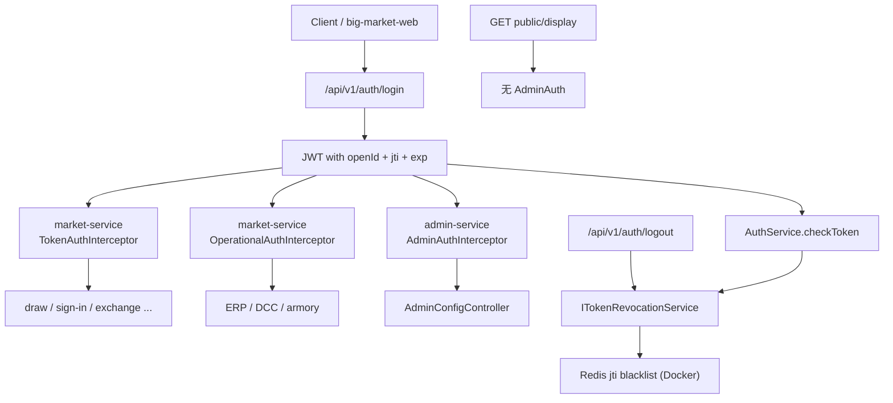

# 05 鉴权与授权

## 用户鉴权

JWT 鉴权在 auth 服务实现。

代码路径：

- `big-market-auth-service/src/main/java/com/dyx/market/auth/AuthAccessController.java`
- `big-market-auth-service/src/main/java/com/dyx/market/auth/config/AuthExceptionHandler.java`
- `big-market-domain/src/main/java/com/dyx/market/domain/auth/service/AuthService.java`
- `big-market-domain/src/main/java/com/dyx/market/domain/auth/service/AbstractAuthService.java`（jjwt 0.11.x 签发/解析）
- `big-market-domain/src/main/java/com/dyx/market/domain/auth/service/ITokenRevocationService.java`
- `big-market-domain/src/main/java/com/dyx/market/domain/auth/config/TokenRevocationConfig.java`
- `big-market-domain/src/main/java/com/dyx/market/domain/auth/util/JwtTokenUtils.java`
- `big-market-domain/src/main/java/com/dyx/market/domain/auth/service/DefaultCredentialGuard.java`

`AuthAccessController.login` 校验 `app.auth.dev-users` 中的学习账号，调用 `AuthService.createToken`，返回含 `openId`、`jti`、`iat`、`exp`、`subject` 的 JWT。`verify` 校验 token 有效性。`logout` 提取 `jti` 并写入共享 `ITokenRevocationService`：

| 模式 | 场景 | 行为 |
| --- | --- | --- |
| 内存 | `token-revocation.redis.enabled=false`（本地默认 `mvn spring-boot:run`） | 进程内黑名单；注销**不会**跨服务同步 |
| Redis | `TOKEN_REVOCATION_REDIS_ENABLED=true`（Docker 栈 auth/admin/market） | 通过 `RedisTokenRevocationService` 共享 Redis 黑名单 |

Redis 模式安全规则：

- **启动 fail-fast**：Redis 模式开启但缺少 `RedissonClient` 时，`TokenRevocationConfig` 抛出 `IllegalStateException`——**不会**静默回退内存模式（否则跨服务注销失效）。
- **注销失败可见**：`RedisTokenRevocationService.revoke()` 在 Redis 写入失败时抛错；`AuthAccessController.logout` 返回错误而非假成功。
- **校验 fail-closed**：`RedisTokenRevocationService.isRevoked()` 在 Redis 读取失败时返回 `true`，故障期间 token 无法绕过黑名单。

`JwtTokenUtils` 规范化 `Authorization` 头，接受裸 JWT 或 `Bearer <jwt>`。

## 用户授权

用户 API 由 **market-service** 的 `TokenAuthInterceptor` 保护：

- `big-market-market-service/src/main/java/com/dyx/market/market/config/TokenAuthInterceptor.java`
- 注册路径见 `big-market-market-service/.../WebMvcConfig.java`（CORS 由 `big-market-starter-web` 的 `CorsAutoConfiguration` 统一提供）

拦截器校验 `Authorization`，将 `userId` 写入 request；带 `_by_token` 后缀的控制器方法使用该值，**不信任**请求体中的 userId。

典型受保护 API：

- `/api/v1/raffle/activity/draw_by_token`
- `/api/v1/raffle/activity/calendar_sign_rebate_by_token`
- `/api/v1/raffle/activity/query_user_activity_account_by_token`
- `/api/v1/raffle/activity/query_user_credit_account_by_token`
- `/api/v1/raffle/activity/credit_pay_exchange_sku_by_token`
- `/api/v1/raffle/activity/chat_credit_deduct_by_token` / `chat_credit_refund_by_token`
- `/api/v1/raffle/strategy/query_raffle_award_list_by_token`

## 管理员授权

管理员鉴权分两类路径（网关路由决定落在哪个服务）：

### 1. 平台配置（admin-service）

- `big-market-admin-service/.../AdminAuthInterceptor.java`
- `big-market-admin-service/.../WebMvcConfig.java` — 仅拦截 `/api/*/admin/**`（CORS 同上由 starter-web 提供）
- `big-market-admin-service/.../AdminExceptionHandler.java` — 统一 HTTP 异常响应
- 校验 JWT，`openId` 须在 `app.admin.user-ids` 白名单内

### 2. 运营接口（market-service）

ERP、DCC、活动/策略预热等经网关走 **market-service**（`/api/**` 兜底路由），由 `OperationalAuthInterceptor` 拦截：

- `big-market-market-service/.../OperationalAuthInterceptor.java`
- 注册路径：`/api/*/raffle/erp/**`、`/api/*/raffle/dcc/**`、`/api/*/raffle/activity/armory`、`/api/*/raffle/strategy/strategy_armory`

统一校验逻辑在 domain 层：

- `big-market-domain/.../AdminAccessService.java` — 支持 `X-Admin-Token` 静态比对，或管理员 JWT + 白名单
- HTTP：`OperationalAuthInterceptor` 校验通过后写入 `operationalAuthPassed` 请求属性（`OperationalAuthConstants`）
- **Controller 不再重复** `hasAdminAccess()`；`ErpOperateController`、`DCCController` 直接执行业务，异常由 `GlobalExceptionHandler` 统一返回
- Dubbo：`ErpOperateServiceRPC` 无 token 重载直接拒绝；带 token 重载经 `DubboRpcAuthSupport.requireAdmin()` 校验后再委托 Controller
- 活动 Dubbo：`RaffleActivityServiceRPC` 对敏感无 token 重载拒绝；token 重载经 `AuthenticatedUserSupport` + application service
- 策略 Dubbo：`RaffleStrategyServiceRPC` 同样拒绝 `strategyArmory` / `randomRaffle` 等无 token 重载
- 账户/履约/策略独立服务：Dubbo Provider 经 `big-market-starter-dubbo` 校验 `app.internal-rpc.token`（`enforce=true` 时生效）

凭证方式（学习环境）：

- 请求头 `X-Admin-Token: admin-dev-token`（与 `app.admin.token` / `erp.admin.token` 配置一致）
- 或 `Authorization: Bearer <admin-jwt>`，且 JWT 的 `openId` 为 `admin`（默认 `app.admin.user-ids`）

## 公开只读接口（无管理员鉴权）

`GET /api/v1/admin/config/public/display?activityId=` 供用户端拉取活动展示配置与 Chatbot 开关，**不需要**管理员 token。

- 入口：`AdminConfigController.publicDisplay`
- 排除规则：admin-service `WebMvcConfig` 中 `.excludePathPatterns("/api/*/admin/config/public/**")`
- 网关：走 `/admin/**` 路由至 admin-service
- 前端：`big-market-web/app.js` 的 `loadDisplayConfig()` 在解析 `activityId` 后调用

## 鉴权关系图

## 学习说明

`app.auth.dev-users` 是本地学习用凭证源。`DefaultCredentialGuard` 在非开发 profile 下阻止不安全默认凭证。真实生产身份体系超出本作品集范围。
