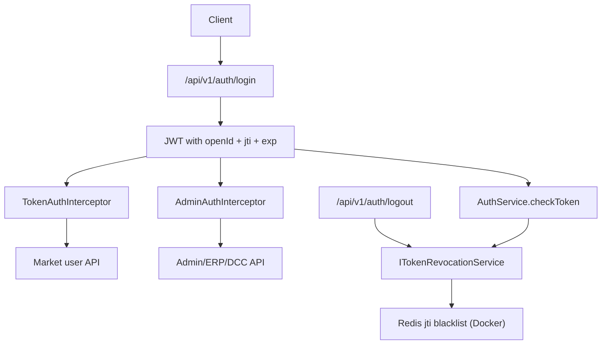

# 05 Authentication And Authorization

## User Authentication

JWT authentication is implemented in the auth service.

Code paths:

- `big-market-auth-service/src/main/java/com/dyx/market/auth/AuthAccessController.java`
- `big-market-domain/src/main/java/com/dyx/market/domain/auth/service/AuthService.java`
- `big-market-domain/src/main/java/com/dyx/market/domain/auth/service/ITokenRevocationService.java`
- `big-market-domain/src/main/java/com/dyx/market/domain/auth/config/TokenRevocationConfig.java`
- `big-market-domain/src/main/java/com/dyx/market/domain/auth/util/JwtTokenUtils.java`
- `big-market-domain/src/main/java/com/dyx/market/domain/auth/service/DefaultCredentialGuard.java`

`AuthAccessController.login` validates configured learning users from
`app.auth.dev-users`, calls `AuthService.createToken`, and returns a JWT with
`openId`, `jti`, `iat`, `exp`, and `subject`. `verify` checks token validity.
`logout` extracts `jti` and records token revocation in the shared
`ITokenRevocationService` bean:

| Mode | When | Behavior |
| --- | --- | --- |
| In-memory | `token-revocation.redis.enabled=false` (default local `mvn spring-boot:run`) | Per-process blacklist; logout does **not** sync across services |
| Redis | `TOKEN_REVOCATION_REDIS_ENABLED=true` (Docker stack for auth/admin/market) | Shared Redis blacklist via `RedisTokenRevocationService` |

Redis mode safety rules:

- **Startup fail-fast:** if Redis mode is enabled but `RedissonClient` is missing,
  `TokenRevocationConfig` throws `IllegalStateException` — it does **not** silently
  fall back to in-memory (which would break cross-service logout).
- **Logout fail-visible:** `RedisTokenRevocationService.revoke()` throws on Redis
  write failure; `AuthAccessController.logout` returns an error instead of
  pretending success.
- **Verify fail-closed:** `RedisTokenRevocationService.isRevoked()` returns `true`
  when Redis read fails, so tokens cannot bypass the blacklist during outages.

`JwtTokenUtils` normalizes `Authorization` headers, accepting either a raw JWT or
`Bearer <jwt>`.

## User Authorization

User APIs are guarded by `TokenAuthInterceptor`:

- `big-market-market-service/src/main/java/com/dyx/market/market/config/TokenAuthInterceptor.java`

The legacy monolith copy has been removed. The interceptor validates
`Authorization`, writes
`userId` into the request, and token-aware controller methods use that value
instead of trusting request body user ids.

Typical protected APIs:

- `/api/v1/raffle/activity/draw_by_token`
- `/api/v1/raffle/activity/calendar_sign_rebate_by_token`
- `/api/v1/raffle/activity/query_user_activity_account_by_token`
- `/api/v1/raffle/activity/query_user_credit_account_by_token`
- `/api/v1/raffle/activity/credit_pay_exchange_sku_by_token`
- `/api/v1/raffle/strategy/query_raffle_award_list_by_token`

## Admin Authorization

Admin APIs are guarded by JWT admin allow-lists or a configured admin token.

Code paths:

- `big-market-admin-service/src/main/java/com/dyx/market/admin/service/config/AdminAuthInterceptor.java`
- `big-market-trigger/src/main/java/com/dyx/market/trigger/http/ErpOperateController.java`
- `big-market-trigger/src/main/java/com/dyx/market/trigger/http/DCCController.java`

Admin config APIs use `AdminAuthInterceptor`. ERP and DCC endpoints accept
`X-Admin-Token` or an admin JWT whose `openId` is listed in
`app.admin.user-ids`.

## Learning Notes

`app.auth.dev-users` is a local learning credential source. The guard in
`DefaultCredentialGuard` prevents unsafe default credentials in non-development
profiles. A real production identity system is outside this portfolio scope.
