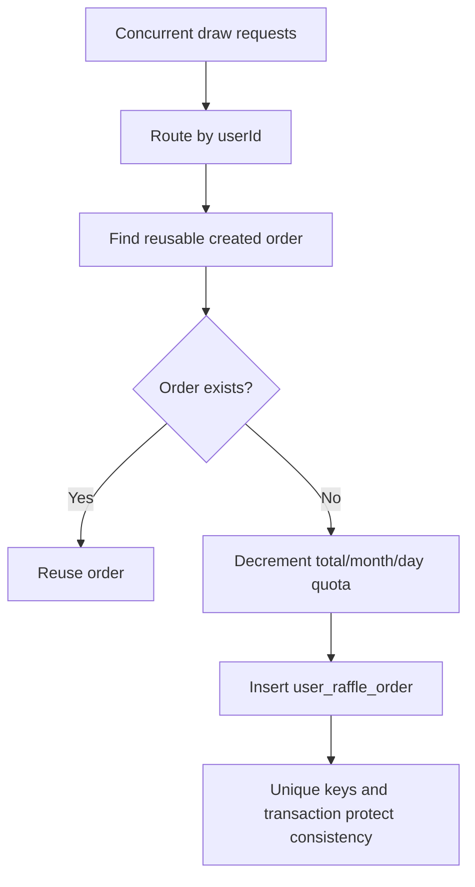

# 06 High-Concurrency Scenarios

## Implemented Mechanisms

- Redis atomic decrement for SKU and award stock.
- Redisson locks for account and task concurrency.
- MySQL unique indexes for idempotency.
- User-id based DB/table routing through `big-market-starter-db-router`.
- RabbitMQ listener prefetch and retry behavior.
- XXL-Job handlers guarded by Redisson locks.

## Raffle Quota Consumption

Code paths:

- `big-market-domain/src/main/java/com/dyx/market/domain/activity/application/RaffleApplicationService.java`
- `big-market-domain/src/main/java/com/dyx/market/domain/activity/service/partake/AbstractRaffleActivityPartake.java`
- `big-market-infrastructure/src/main/java/com/dyx/market/infrastructure/adapter/repository/ActivityRepository.java`
- `big-market-account-service/src/main/java/com/dyx/market/account/provider/AccountQuotaServiceRPC.java`

## SKU And Award Stock

SKU exchange uses Redis counters and a stock-zero message. Award stock is
deducted by strategy logic and later synchronized by jobs.

Code paths:

- `big-market-infrastructure/src/main/java/com/dyx/market/infrastructure/adapter/repository/ActivityRepository.java`
- `big-market-trigger/src/main/java/com/dyx/market/trigger/job/UpdateActivitySkuStockJob.java`
- `big-market-trigger/src/main/java/com/dyx/market/trigger/job/UpdateAwardStockJob.java`
- `big-market-trigger/src/main/java/com/dyx/market/trigger/listener/ActivitySkuStockZeroConsumer.java`

## Credit Account Concurrency

Credit writes use business ids, Redisson locks, and conditional DB updates to
avoid double deduction or negative balances.

Code paths:

- `big-market-infrastructure/src/main/java/com/dyx/market/infrastructure/adapter/repository/CreditRepository.java`
- `big-market-account-service/src/main/java/com/dyx/market/account/provider/AccountCreditServiceRPC.java`
- `big-market-domain/src/main/java/com/dyx/market/domain/credit/model/aggregate/TradeAggregate.java`

## MQ And Task Concurrency

Duplicate messages are handled through message ids, business ids, and duplicate
key handling. Jobs use locks before scanning task rows.

Code paths:

- `big-market-trigger/src/main/java/com/dyx/market/trigger/listener/RebateMessageConsumer.java`
- `big-market-trigger/src/main/java/com/dyx/market/trigger/listener/SendAwardConsumer.java`
- `big-market-trigger/src/main/java/com/dyx/market/trigger/listener/CreditAdjustSuccessConsumer.java`
- `big-market-trigger/src/main/java/com/dyx/market/trigger/job/SendMessageTaskJob.java`
- `big-market-message-job-service/src/main/java/com/dyx/market/message/job/config/DispatchCreditAwardTaskJob.java`
