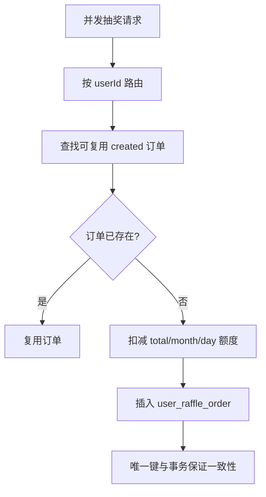

# 06 高并发场景

## 已实现机制

- Redis 原子递减用于 SKU 与奖品库存。
- Redisson 锁保护账户与任务并发。
- MySQL 唯一索引保证幂等。
- 基于 userId 的库表路由（`big-market-starter-db-router`）。
- RabbitMQ 监听器 prefetch 与重试行为。
- XXL-Job 处理器由 Redisson 锁保护。

## 抽奖额度消耗

代码路径：

- `big-market-domain/src/main/java/com/dyx/market/domain/activity/application/RaffleApplicationService.java`
- `big-market-domain/src/main/java/com/dyx/market/domain/activity/service/partake/AbstractRaffleActivityPartake.java`
- `big-market-infrastructure/src/main/java/com/dyx/market/infrastructure/adapter/repository/ActivityPartakeOrderSupport.java`
- `big-market-infrastructure/src/main/java/com/dyx/market/infrastructure/adapter/repository/ActivityQuotaLedgerSupport.java`
- `big-market-account-service/src/main/java/com/dyx/market/account/provider/AccountQuotaServiceRPC.java`

## SKU 与奖品库存

SKU 兑换使用 Redis 计数器与库存归零消息。奖品库存由策略逻辑扣减，后续由 Job 同步。

代码路径：

- `big-market-infrastructure/src/main/java/com/dyx/market/infrastructure/adapter/repository/ActivitySkuStockCacheSupport.java`
- `big-market-trigger/src/main/java/com/dyx/market/trigger/job/UpdateAwardStockJob.java`
- `big-market-trigger/src/main/java/com/dyx/market/trigger/listener/ActivitySkuStockZeroConsumer.java`

## 积分账户并发

积分写入使用业务 ID、Redisson 锁与条件更新，避免重复扣减或余额为负。

代码路径：

- `big-market-infrastructure/src/main/java/com/dyx/market/infrastructure/adapter/repository/CreditRepository.java`
- `big-market-account-service/src/main/java/com/dyx/market/account/provider/AccountCreditServiceRPC.java`
- `big-market-domain/src/main/java/com/dyx/market/domain/credit/model/aggregate/TradeAggregate.java`

## MQ 与任务并发

重复消息通过 message id、business id 与重复键处理消化。Job 扫描任务行前先加锁。监听器与 Job **仅在 message-job** 激活；跳转表见 [09-code-map.md](09-code-map.md)。

代码路径：

- `big-market-trigger/.../listener/RebateMessageConsumer.java`
- `big-market-trigger/.../listener/SendAwardConsumer.java`
- `big-market-trigger/.../listener/CreditAdjustSuccessConsumer.java`
- `big-market-trigger/.../job/SendMessageTaskJob.java`
- `big-market-message-job-service/.../config/DispatchCreditAwardTaskJob.java`
