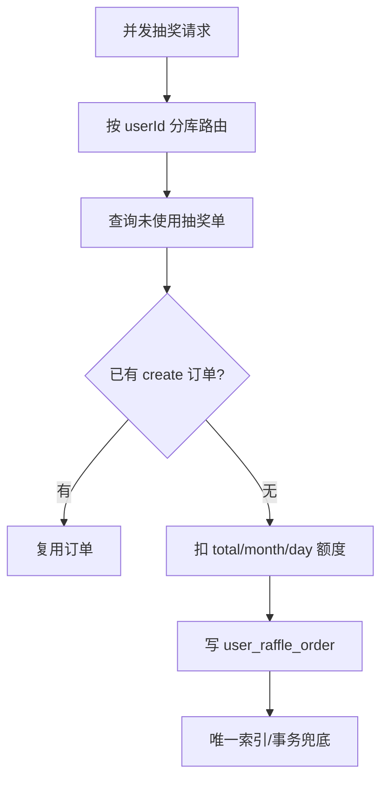

# 06 高并发场景

## 分类

### Already implemented

- Redis 原子扣减 SKU/奖品库存。
- Redisson 锁保护账户/任务并发。
- MySQL 唯一索引冲突作为幂等兜底。
- 分库分表路由按 `userId` 保证同用户交易进入同库表上下文。
- RabbitMQ prefetch=1 控制消费侧压力。
- XXL-Job + Redisson 锁避免多实例重复扫任务。

### Partially implemented

- Dubbo 服务化拆分和远程写适配器：provider/adapter/flag 存在，但默认 false。
- award credit outbox：代码和 proposed SQL 存在，flag 默认 false。
- Gateway rate limiter：docker profile 配置了 `IpPathRateLimit`，dev 默认 false。

### Not implemented, future improvement only

No real implementation found. This is only a future improvement recommendation.

- 全链路压测脚本。
- 完整分布式事务框架。
- 自动 DLQ 重放控制台。

## 场景 1：抽奖扣额度

- Entry: `draw_by_token`
- Key classes: `RaffleApplicationService`、`AbstractRaffleActivityPartake`、`ActivityRepository`
- Existing mechanism: 活动状态/日期校验，查询未使用抽奖单，账户额度扣减和抽奖单写入在事务中完成；失败补偿额度。
- Risk: 远程 quota decrement flag 开启前需要 ledger DDL 和 staging 验证。

## 场景 2：SKU 库存扣减

- Entry: `credit_pay_exchange_sku_by_token`
- Key classes: `ActivityRepository.subtractionActivitySkuStock`、`UpdateActivitySkuStockJob`
- Existing mechanism: Redis `decr` 扣库存，`setNx` 给每个库存水位加锁，库存为 0 时发 MQ 清库，定时任务异步落 DB。
- Remaining risk: Redis 不可用时当前链路没有业务级 fallback。

## 场景 3：积分账户并发扣减

- Entry: 签到、兑换、AI Chat。
- Key classes: `CreditRepository.saveUserCreditTradeOrder`
- Existing mechanism: `USER_CREDIT_ACCOUNT_LOCK + userId + outBusinessNo` Redisson 锁；负数金额用 DB 条件更新防止扣成负数；订单唯一索引防重复。

## 场景 4：MQ 消费重复

- Consumers: `RebateMessageConsumer`、`SendAwardConsumer`、`CreditAdjustSuccessConsumer`
- Existing mechanism: 消费侧捕获 `ResponseCode.INDEX_DUP` 并视为重复消费，不继续失败。
- Remaining risk: DLQ 只记录日志，不自动重放。

## 场景 5：任务扫描

- Jobs: `SendMessageTaskJob_DB1/DB2`、`UpdateActivitySkuStockJob`、`updateAwardStockJob`、`DispatchCreditAwardTaskJob_DB1/DB2`
- Existing mechanism: XXL-Job handler + Redisson `tryLock(3,0)`，防止多实例重复执行。
- Remaining risk: 部分任务用线程池异步执行，线程池饱和时依赖配置 `CallerRunsPolicy`。

