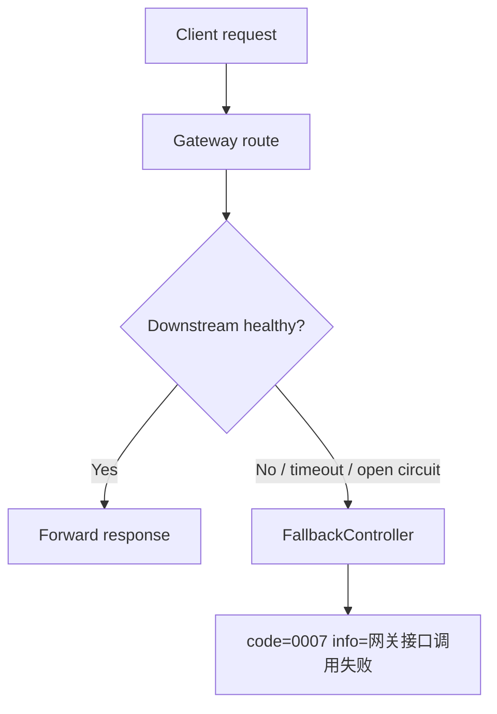
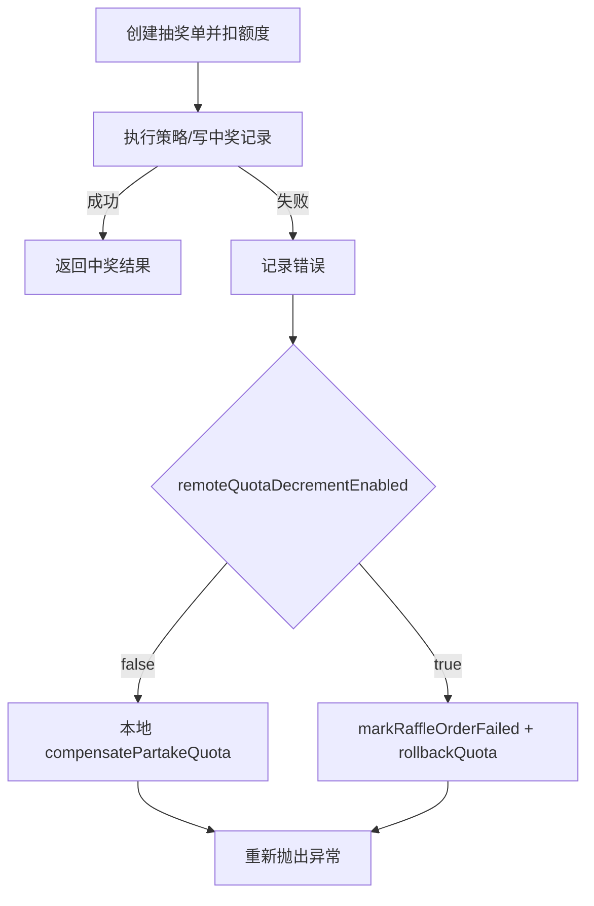

# 07 失败、降级与韧性

## 真实发现的保护

- Gateway CircuitBreaker + fallback JSON：`big-market-gateway/src/main/resources/application.yml`、`FallbackController`
- DCC 降级开关：`RaffleActivityController` 的 `@DCCValue("degradeSwitch:close")`
- 任务表补偿：`TaskRepository`、`SendMessageTaskJob`
- MQ DLQ：`RabbitMQDlqConfig`
- Redis/DB 幂等：唯一索引异常、Redisson 锁
- AI Chat 失败退积分：`ChatbotController.ask`

## 网关失败

当前代码实现了真实网关熔断。The current code does not implement a real circuit breaker for every downstream call inside business services.

## 抽奖失败补偿

- Scenario: 抽奖单创建后，策略或中奖记录失败。
- Current behavior: `RaffleApplicationService.executeDraw` catch 后调用本地 `activityRepository.compensatePartakeQuota`，或远程模式下先 `markRaffleOrderFailed` 再 `activityAccountPort.rollbackQuota`。
- Risk: 远程模式默认 false；开启前需要 ledger 表和完整验证。

## MQ 发送失败补偿

- Scenario: 写库成功后发布 MQ 失败。
- Current behavior: 仓储写 task/outbox；发送 MQ 成功则标记 completed，失败则标记 fail；XXL-Job 后续扫描重发。
- Code: `AwardRepository.saveUserAwardRecord`、`CreditRepository.saveUserCreditTradeOrder`、`BehaviorRebateRepository.saveUserRebateRecord`、`SendMessageTaskJob`。

## MQ 消费失败

- Scenario: 消费者抛异常。
- Current behavior: Rabbit listener 配置 `x-dead-letter-exchange=dlx`；`RabbitMQDlqConfig` 声明 DLQ 并记录日志。
- Missing protection: DLQ 自动重放 Not found in current code.

## AI Chat 失败

- Scenario: 积分已扣，DeepSeek/AI 调用失败。
- Current behavior: `ChatbotController` catch 后调用 refund API，使用 `chat_refund_{requestId}` 幂等 key。
- Risk: 退积分 API 也失败时，只返回失败；未发现后续补偿任务。

## Redis/MySQL/Nacos/RabbitMQ 依赖失败

- Redis 失败：高并发库存、锁、缓存路径会失败；业务级 fallback Not found in current code.
- MySQL 失败：仓储异常，controller 返回 `UN_ERROR`；无本地缓存写入替代。
- RabbitMQ 失败：写 task 后发送失败标记 fail，任务补偿；若消费者失败进入 DLQ。
- Nacos/Dubbo 失败：部分 `check=false`，启动不一定失败；远程适配器默认 false 或带本地 fallback 的配置注释存在。

