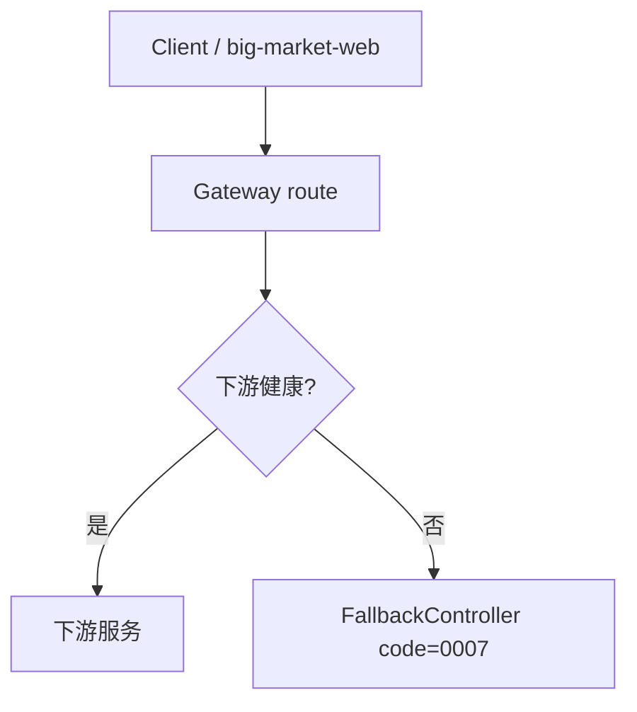

# 07 故障、降级与回滚

## 网关韧性

网关熔断在下游不可用时返回统一 JSON 响应。

代码路径：

- `big-market-gateway/src/main/resources/application.yml`
- `big-market-gateway/src/main/java/com/dyx/market/gateway/fallback/FallbackController.java`
- `big-market-gateway/src/main/java/com/dyx/market/gateway/filter/TraceIdGlobalFilter.java`

前端 `big-market-web` 在网关或业务错误时通过 toast 提示；`loadDisplayConfig` 失败时回退默认活动标题，不阻断主流程。

## 抽奖回滚

抽奖编排失败且额度已消耗时，应用服务记录失败订单路径，并通过配置的账户端口恢复额度。

代码路径：

- `big-market-domain/src/main/java/com/dyx/market/domain/activity/application/RaffleApplicationService.java`
- `big-market-domain/src/main/java/com/dyx/market/domain/activity/adapter/port/IActivityAccountPort.java`
- `big-market-infrastructure/src/main/java/com/dyx/market/infrastructure/adapter/port/LocalActivityAccountPort.java`
- `big-market-account-service/src/main/java/com/dyx/market/account/application/AccountQuotaApplicationService.java`
- `big-market-account-service/src/main/java/com/dyx/market/account/provider/AccountQuotaServiceRPC.java`
- `big-market-message-job-service/src/main/java/com/dyx/market/message/job/config/WriteAdapterLocalConfig.java`

## 任务重试与 MQ 失败

Repository 在业务事务中写入 task/outbox 行。MQ 发送成功则标记完成；发送失败保留可重试 task 状态供 XXL-Job 扫描。

代码路径：

- `big-market-infrastructure/src/main/java/com/dyx/market/infrastructure/adapter/repository/AwardRepository.java`
- `big-market-infrastructure/src/main/java/com/dyx/market/infrastructure/adapter/repository/CreditRepository.java`
- `big-market-infrastructure/src/main/java/com/dyx/market/infrastructure/adapter/repository/BehaviorRebateRepository.java`
- `big-market-trigger/src/main/java/com/dyx/market/trigger/job/SendMessageTaskJob.java`
- `big-market-message-job-service/src/main/java/com/dyx/market/message/job/config/RabbitMQDlqConfig.java`

## 积分退款

Chatbot 扣费在 AI 调用失败时显式退款。退款请求以 `chat_refund_{requestId}` 为幂等键。

代码路径：

- `big-market-chatbot-service/src/main/java/com/dyx/market/chatbot/ChatbotController.java`
- `big-market-trigger/src/main/java/com/dyx/market/trigger/http/RaffleActivityController.java`
- `big-market-infrastructure/src/main/java/com/dyx/market/infrastructure/adapter/repository/CreditRepository.java`

前端在 Chatbot 返回扣费信息时更新本地积分流水（`localStorage`），与后端账本互补展示。

## 运营回滚

本地学习场景下，回滚指将配置恢复为默认本地开发值、在修改 outbox 行为前停止派发 Job，并重新跑冒烟检查。详细步骤见 `docs/operations-checklist.md` 与 `docs/production-readiness-learning.md`。

## 高风险变更区域

项目为学习稳定而维护。涉及积分、额度、奖品或返利语义的变更，需 DDL 评审、冒烟测试、幂等检查与回滚验证后方可视为完成。

| 区域 | 风险原因 | 学习处理方式 |
| --- | --- | --- |
| 远程额度扣减 | 抽奖依赖恰好一次的额度消耗 | 保持账本幂等与回滚路径可文档化、可测试 |
| Award-credit outbox | 奖品完成从直写变为异步派发 | 保持 DDL、dispatcher 与重复键行为有文档 |
| 各领域 task outbox | 改变任务归属与重试面 | 保持 outbox DDL 引用与共享 task 派发路径有文档 |
| DLQ 重放 | 自动重放可能重复积分或发奖 | 保持 DLQ 日志；重放前需人工幂等评审 |
| 真实用户体系 | 用持久化账号替换配置用户 | 超出当前作品集范围 |

回滚原则：

- 服务路由与写适配器选择优先用配置回滚。
- 保留幂等键：`out_business_no`、`award_order_id`、`message_id`、`requestId` 及额度账本键。
- 修改 outbox 归属前先停止派发 Job。
- 任何重试或回滚练习后，核对账户余额、额度剩余、中奖记录与 task 状态。

另见 `docs/data-and-outbox.md` 与 `archive/risky-changes-remediation.md`。
