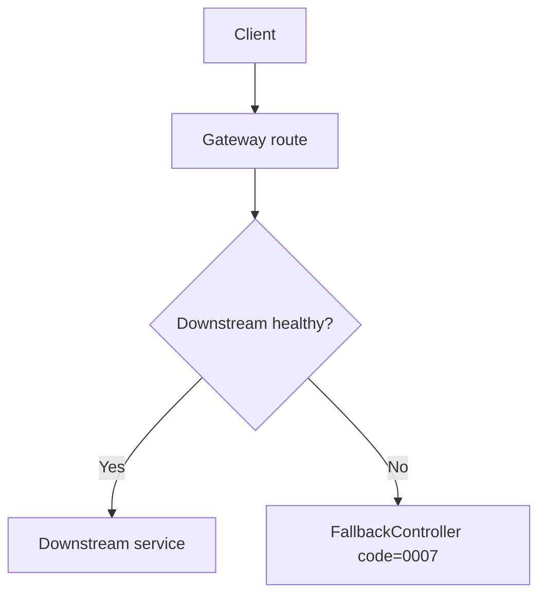

# 07 Failure, Degradation, And Rollback

## Gateway Resilience

Gateway circuit breakers return a consistent JSON response when a downstream
service is unavailable.

Code paths:

- `big-market-gateway/src/main/resources/application.yml`
- `big-market-gateway/src/main/java/com/dyx/market/gateway/fallback/FallbackController.java`
- `big-market-gateway/src/main/java/com/dyx/market/gateway/filter/TraceIdGlobalFilter.java`

## Draw Rollback

If draw orchestration fails after quota is consumed, the application service
records the failed order path and restores quota through the configured account
port.

Code paths:

- `big-market-domain/src/main/java/com/dyx/market/domain/activity/application/RaffleApplicationService.java`
- `big-market-domain/src/main/java/com/dyx/market/domain/activity/adapter/port/IActivityAccountPort.java`
- `big-market-infrastructure/src/main/java/com/dyx/market/infrastructure/adapter/port/LocalActivityAccountPort.java`
- `big-market-account-service/src/main/java/com/dyx/market/account/provider/AccountQuotaServiceRPC.java`

## Task Retry And MQ Failure

Repositories write task/outbox rows with the business transaction. MQ send
success marks the row complete; send failure leaves a retryable task state for
XXL-Job scanning.

Code paths:

- `big-market-infrastructure/src/main/java/com/dyx/market/infrastructure/adapter/repository/AwardRepository.java`
- `big-market-infrastructure/src/main/java/com/dyx/market/infrastructure/adapter/repository/CreditRepository.java`
- `big-market-infrastructure/src/main/java/com/dyx/market/infrastructure/adapter/repository/BehaviorRebateRepository.java`
- `big-market-trigger/src/main/java/com/dyx/market/trigger/job/SendMessageTaskJob.java`
- `big-market-message-job-service/src/main/java/com/dyx/market/message/job/config/RabbitMQDlqConfig.java`

## Credit Refund

Chatbot charging uses explicit refund on AI call failure. The refund request
uses `chat_refund_{requestId}` as the idempotency key.

Code paths:

- `big-market-chatbot-service/src/main/java/com/dyx/market/chatbot/ChatbotController.java`
- `big-market-trigger/src/main/java/com/dyx/market/trigger/http/RaffleActivityController.java`
- `big-market-infrastructure/src/main/java/com/dyx/market/infrastructure/adapter/repository/CreditRepository.java`

## Operational Rollback

For local learning, rollback means returning configuration to the default local
development values, stopping dispatch jobs before changing outbox behavior, and
rerunning smoke checks. Detailed steps are in `docs/operations-checklist.md`
and `docs/production-readiness-learning.md`.
