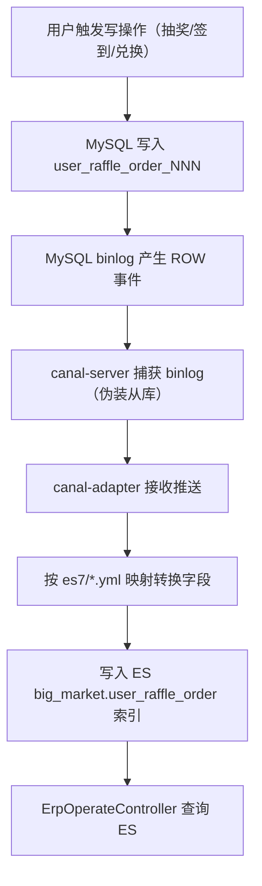

# 17 Canal/ES 数据同步

本文说明 Big Market 如何通过 Canal 将 MySQL 数据实时同步到 Elasticsearch，以及 ERP 运营查询的数据来源。

---

## 为什么需要 ES？

运营需要查询跨用户的抽奖订单（如"活动 100301 的所有订单"）。但 `user_raffle_order` 和 `raffle_activity_order` 都按 userId 分库分表（2库×4表），跨用户聚合查询需要扫描 8 张分表，性能差。

解决方案：将这两张表的数据**实时同步到 ES**，运营查询走 ES 索引，不触碰 MySQL 分片。

代码入口：`ErpOperateController` → `ESUserRaffleOrderRepository`。

---

## Canal 架构

```
MySQL (binlog) ──→ canal-server ──→ canal-adapter ──→ Elasticsearch
                    (伪装从库)      (数据分发器)      (big_market.* 索引)
```

### 三个角色

| 组件 | 容器 | 端口 | 职责 |
|------|------|------|------|
| canal-server | `canal-server` | 11111 | 订阅 MySQL binlog，伪装成 MySQL 从库 |
| canal-adapter | `canal-adapter` | 18082 | 接收 canal-server 推送，写入 ES |
| Elasticsearch | `elasticsearch` | 9200 | 存储同步后的数据，供查询 |

---

## canal-server 配置

配置文件：`docs/dev-ops/canal/instance.properties`

关键参数：
```properties
canal.instance.mysql.slaveId=3           # 伪装的从库 ID（不能和真实从库冲突）
canal.instance.master.address=mysql:3306  # 监听的 MySQL 地址
canal.instance.dbUsername=canal          # MySQL 账号（需要 REPLICATION 权限）
canal.instance.filter.regex=.*\\..*      # 监听所有库所有表
```

MySQL 需为 canal 账号授权：
```sql
GRANT SELECT, REPLICATION SLAVE, REPLICATION CLIENT ON *.* TO 'canal'@'%';
```

---

## canal-adapter 配置

配置文件：`docs/dev-ops/canal-adapter/conf/application.yml`

```yaml
canal.conf:
  mode: tcp                              # 通过 TCP 连接 canal-server
  srcDataSources:
    big_market_01:
      url: jdbc:mysql://mysql:3306/big_market_01
      username: canal
    big_market_02:
      url: jdbc:mysql://mysql:3306/big_market_02
      username: canal
  canalAdapters:
  - instance: example
    groups:
    - groupId: g1
      outerAdapters:
      - name: es7
        hosts: elasticsearch:9200
```

---

## ES 索引映射（es7/ 目录）

canal-adapter 为每张分表配置一个独立的 yml 映射文件，将分表数据合并写入同一个 ES 索引。

### 索引 1：big_market.user_raffle_order（抽奖订单）

映射文件：`es7/big_market_01_user_raffle_order_000.yml`（共 8 个，对应 2库×4表）

```yaml
esMapping:
  _index: big_market.user_raffle_order
  _id: _id
  sql: "select t.order_id as _id,
               t.user_id as _user_id,
               t.activity_id as _activity_id,
               t.activity_name as _activity_name,
               t.strategy_id as _strategy_id,
               t.order_id as _order_id,
               t.order_time as _order_time,
               t.order_state as _order_state,
               ...
        from user_raffle_order_000 t"
  etlCondition: "where t.update_time>={}"
  commitBatch: 3000
```

**关键设计：** 8 张分表（2库×4）都用 `_index: big_market.user_raffle_order` 同一个索引，ES 侧所有数据合并在一起，运营查询时无需关心分片。

### 索引 2：big_market.raffle_activity_order（SKU 购买订单）

映射文件：`es7/big_market_01_raffle_activity_order_000.yml`（共 8 个）

额外字段：`sku`、`pay_amount`、`out_business_no`，支持运营按支付金额、SKU 过滤。

---

## 数据同步流程



---

## 同步延迟与一致性

| 维度 | 说明 |
|------|------|
| 延迟 | 毫秒级（binlog 实时推送），正常 < 1 秒 |
| 一致性 | 最终一致，非强一致（MySQL 写入后 ES 数据有短暂延迟） |
| 幂等 | `_id = order_id`，重复推送覆盖写，不会重复 |
| 失败处理 | canal-adapter 有重试机制；ES 不可用时 canal-server 会积压 binlog |

---

## ERP 查询代码路径

```
ErpOperateController.queryRaffleActivityOrderListByPage()
    └── ESUserRaffleOrderRepository.queryRaffleActivityOrderByPage()
            └── ElasticsearchRestTemplate.search()  →  ES index: big_market.user_raffle_order
```

查询条件支持：`activityId`、`userId`、时间范围、分页。

---

## 本地验证 ES 同步

```bash
# 查看 ES 索引列表
curl http://127.0.0.1:9200/_cat/indices?v

# 查询 user_raffle_order 数据
curl -X GET "http://127.0.0.1:9200/big_market.user_raffle_order/_search?pretty" \
  -H "Content-Type: application/json" \
  -d '{"query":{"match_all":{}},"size":5}'

# 查看 canal-adapter 日志（确认同步是否正常）
docker logs canal-adapter --tail 30 -f
```

---

## 常见问题

### Canal 同步中断

```bash
# 查看 canal-server 状态
docker logs canal-server --tail 50

# 常见原因：MySQL binlog 未开启 ROW 格式
# 验证：
mysql -h 127.0.0.1 -P 13306 -u root -p123456 -e "show variables like 'binlog_format';"
# 应返回 ROW
```

### ES 索引不存在

canal-adapter 首次推送前，ES 索引需要存在。如果索引不存在，adapter 会尝试自动创建。可手动创建：
```bash
curl -X PUT "http://127.0.0.1:9200/big_market.user_raffle_order"
```

### 历史数据全量同步

canal 默认只同步增量（从当前 binlog 位置开始）。全量同步可通过 canal-adapter 的 ETL 接口触发：
```bash
# 触发全量 ETL（将历史数据同步到 ES）
curl http://127.0.0.1:18082/etl/es7/big_market_01_user_raffle_order_000.yml -X POST
```
